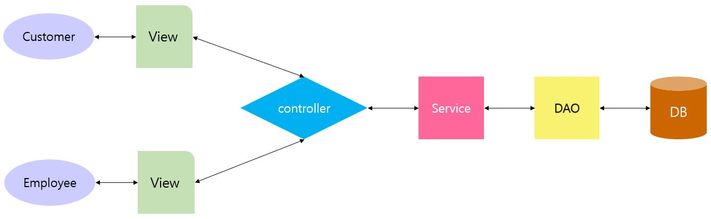
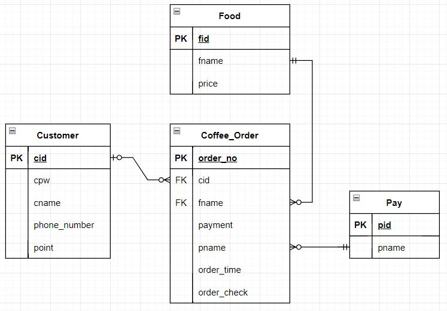
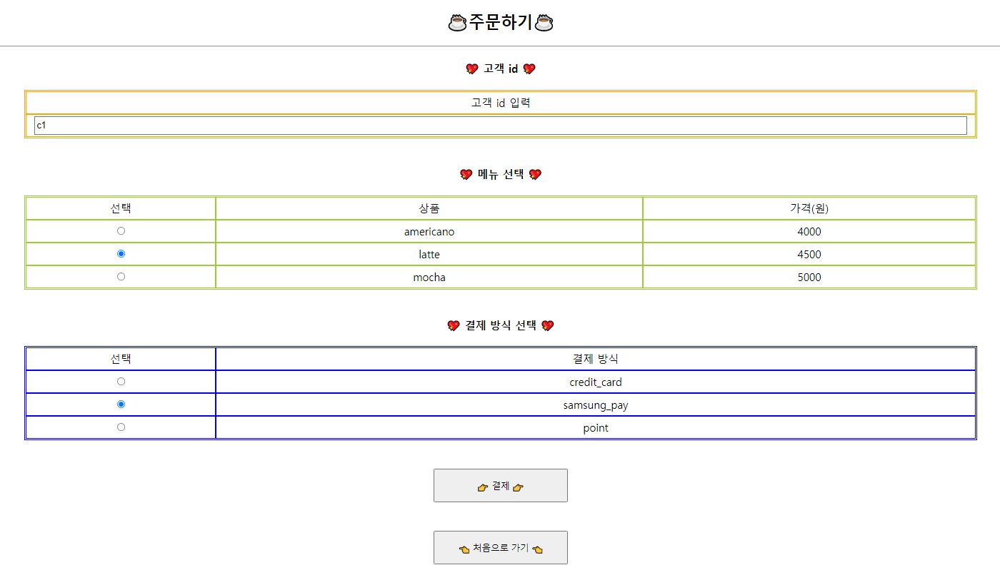
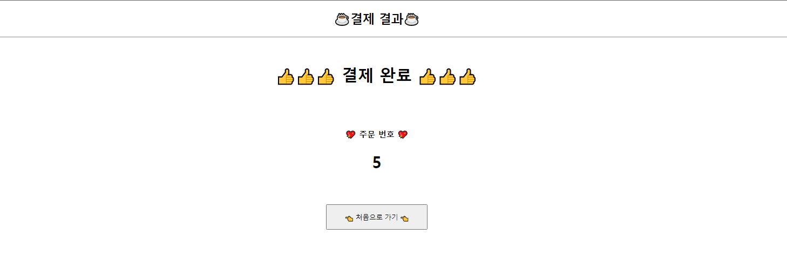
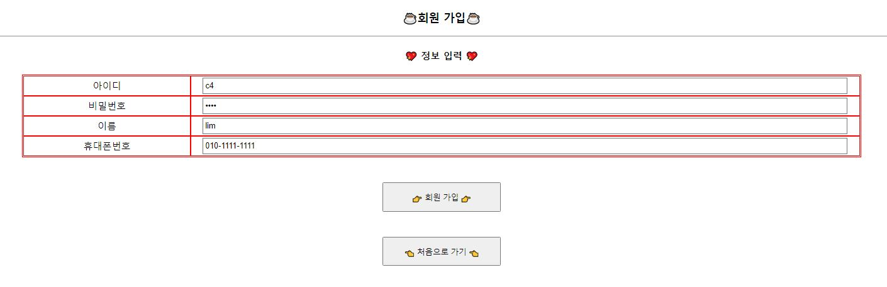
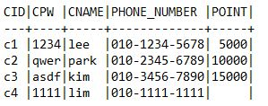
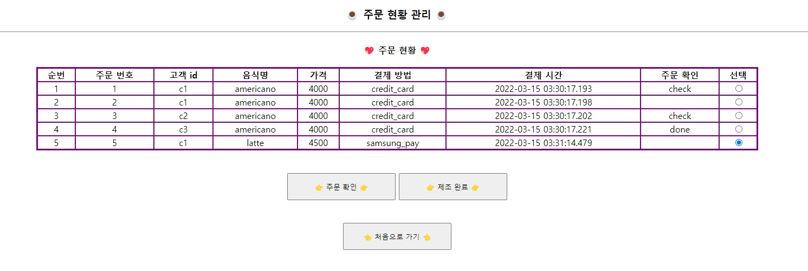
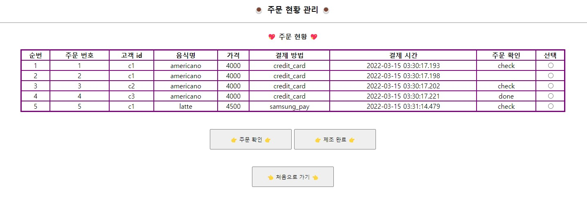

# JSP, Servlet, Tomcat을 활용하여 카페 키오스크 시스템 구현

## 👨‍👨‍👦‍👦 프로젝트 구성원
- [오다솔](https://github.com/ohdasol)
- [임동규](https://github.com/dongkyuu)
- [장우재](https://github.com/WoojaeJang)

## 📑 프로젝트 개요
- 목표 : 고객용, 직원용 키오스크 페이지 각각 구성 후 연결
- 세부 목표 : 고객이 주문을 하면 주문 현황에서 확인이 할 수 있으며, 직원은 해당 주문 상태 변경 가능
- 프로젝트 기간 : 2022/02/10~ 2022/02/11

## 🌟 프로젝트 핵심 기능
- <고객>
  - 주문
  - 주문 현황 확인
  - 회원가입

- <직원>
  - 주문 현황 확인
  - 주문 상태 변경하기

## ⚙️ 프로젝트 동작 구조
- MVC

||
|---|

- DB 구성 (ERD)

||
|---|

## 📽️ 프로젝트 실행 화면 1 - 고객
- 초기 화면

||
|---|

- 기능1 - 1. 주문 하기

||
|---|

- 기능1 - 2. 결제 완료

||
|---|

- 기능2 - 주문 현황 확인

||
|---|

- 기능3 - 회원가입 하기

||
|---|

- 기능3 - 회원가입 결과

||
|---|

- DB에 추가된 결과  

|  |
|---|

    
    
## 📽️ 프로젝트 실행 화면 2 - 직원
- 초기 화면

||
|---|

- 기능1 - 주문 현황 확인

||
|---|

- 기능2 - 주문 상태 변경하기

||
|---|

## ❗ Issues
- sysdate 출력 형식 관련 이슈
    - cmd에서 DB에 접속 후, select sysdate from duel; 문잘 실행 시 yy/mm/dd 형식으로 출력됨
    - 이것을 yyyy-mm-dd hh:mi:ss 형식으로 출력하기 위해 다음과 같이 세션 변경 문장 실행
      - ALTER session SET NLS_DATE_FORMAT='yyyy-mm-dd hh:mi:ss';

- tomcat 포트 관련 이슈
    - 코드 실행 에러 내용 : Port 8005 required by Tomcat v9.0 Server at localhost is already in use
      - 해결 순서 :
        - cmd 실행
        - netstat -p tcp ano 입력 후 엔터
        - 8005에 해당하는 pid 번호 확인 후, taskkill /f /pid pid번호 입력 후 엔터

## 🔨 개선할 사항
- point로 결제시, 보유 포인트 확인 및 결제 금액 만큼 고객 테이블의 포인트에서 차감 
- id 입력하면 포인트 쌓이는 방식이므로, 보유 포인트에 결제 금액의 5% 적립
- 직원이 주문 상태를 변경하기 위해 해당 주문을 선택할 때, 중복 선택이 안되므로 한번에 선택하는 기능 추가
- 직원용 페이지에서 고객관리 미완성

## 😟 아쉬운점
- 디자인을 전혀 신경쓰지 못했음.
- servlet과 최근에 배운 react가 섞여서 혼란스러움.

 