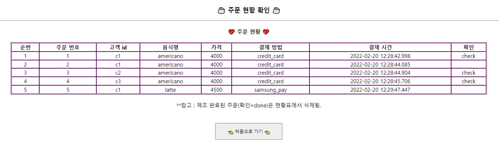
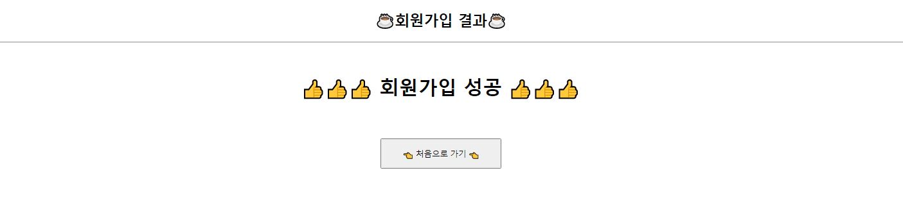
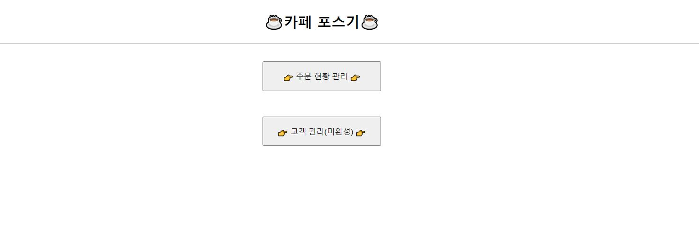

# CafeKioskSystem-JavaWebProject

### 주제 : 카페 키오스크 시스템 구현

### 팀원 구성
- [오다솔](https://github.com/ohdasol)
- [임동규](https://github.com/dongkyuu)
- [장우재](https://github.com/WoojaeJang)

### 프로젝트 내용 : 카페 키오스크 시스템

### 프로젝트 기간 : 2022/02/10~ 2022/02/11

### 핵심 기능
- <고객>
  - 주문
  - 주문 현황 확인
  - 회원가입

- <직원>
  - 주문 현황 확인
  - 주문 상태 변경하기

### 동작 구조
- MVC  

- DB 구성 (ERD)  

### 실행 화면
### <고객>
- 초기 화면

- 기능1 - 1. 주문 하기

- 기능1 - 2. 결제 완료

- 기능2 - 주문 현황 확인

- 기능3 - 회원가입 하기

- 기능3 - 회원가입 결과

  - DB에 추가된 결과  
    
    
    
    
### <직원>
- 초기 화면

- 기능1 - 주문 현황 확인

### Issues
1. sysdate 출력 형식 관련 이슈
    - cmd에서 DB에 접속 후, select sysdate from duel; 문잘 실행 시 yy/mm/dd 형식으로 출력됨
    - 이것을 yyyy-mm-dd hh:mi:ss 형식으로 출력하기 위해 다음과 같이 세션 변경 문장 실행
      - ALTER session SET NLS_DATE_FORMAT='yyyy-mm-dd hh:mi:ss';

2. tomcat 포트 관련 이슈
    - 코드 실행 에러 내용 : Port 8005 required by Tomcat v9.0 Server at localhost is already in use
      - 해결 순서 :
        - cmd 실행
        - netstat -p tcp ano 입력 후 엔터
        - 8005에 해당하는 pid 번호 확인 후, taskkill /f /pid pid번호 입력 후 엔터

### 개선할 사항
- point로 결제시, 보유 포인트 확인 및 결제 금액 만큼 고객 테이블의 포인트에서 차감 
- id 입력하면 포인트 쌓이는 방식이므로, 보유 포인트에 결제 금액의 5% 적립
- 직원이 주문 상태를 변경하기 위해 해당 주문을 선택할 때, 중복 선택이 안되므로 한번에 선택하는 기능 추가
- 직원용 창의 주문확인 창에서 상태가 done인 주문은 선택 버튼 비활성화
- 직원용 창의 고객 관리 기능 완성하기